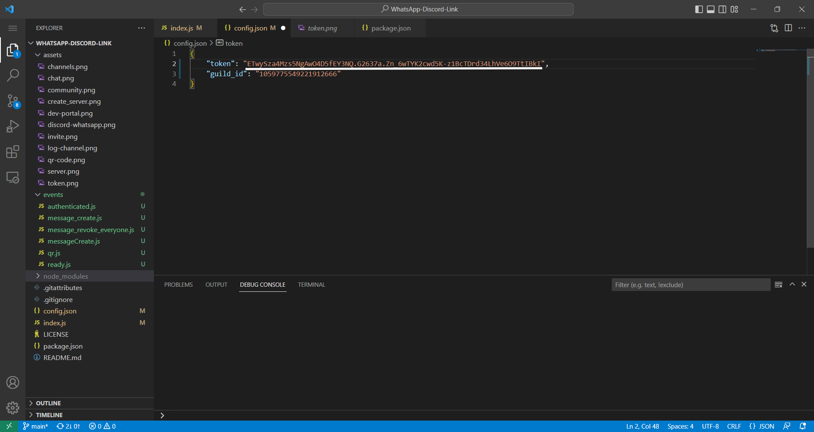
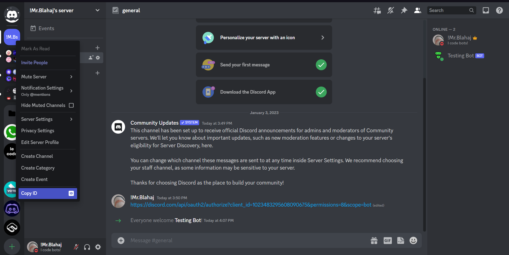

# **WhatsAppDiscordLink**
 This app links your discord to whatsapp through the use of package `whatsapp-web.js`. 

# Packages Required
- whatsapp-web.js
- discord.js
- qrcode-terminal
- fs

# How to use
**Step 1:** Create a server. To do that log into Discord, scroll down to the bottom untill you see a + icon, click it and follow the steps

  

**Step 2:** Enable Community. This can be done by going into Server Settings -> Community -> Enable Community. Click the Get Started Button and follow the steps.

  

**Step 3:** Invite your bot with manage server permissions. This can be done using this [link](https://discord.com/api/oauth2/authorize?client_id=YourBotID&permissions=8&scope=bot) and replacing {YourBotID} with Your Bot ID

  

**Step 4:** Copy your Bot Token. Token can be obtained by going to [Discord Developer Portal](https://discord.com/developers/applications) and then going into applications -> Bot -> Reset Token. Once regerated you won't be able to view the token again, I reccomend you store it in a safe space.

  

**Step 5:** Paste your Bot Token on **Line 9** of index.js

  

**Step 6:** Copy your server ID, this can be done by right clicking the server icon and clicking "Copy ID" button

  

**Step 7:** Paste your server ID on **line 10** of index.js

**Step 8:** Execute index.js. After starting, the bot will automatically generate 3 channels which can later re-named

  
If the channels are not generated, it means there was some problem with the permissions, check console for more info.
  

**Step 9:** After the channels are created, go to the log channel and wait for a qr code

  

**Step 10:** Scan the QR code using your WhatsApp Mobile app

  

All messages in your WhatsApp will automatically be Logged in your Discord
  

  

To reply to message, just send a message in the thread where the chat is, the message will automatically be posted to WhatsApp
  

  
